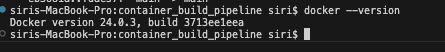
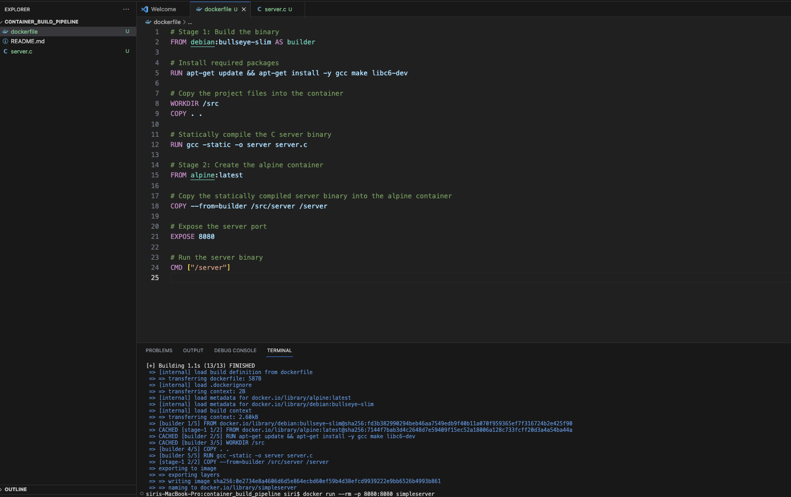
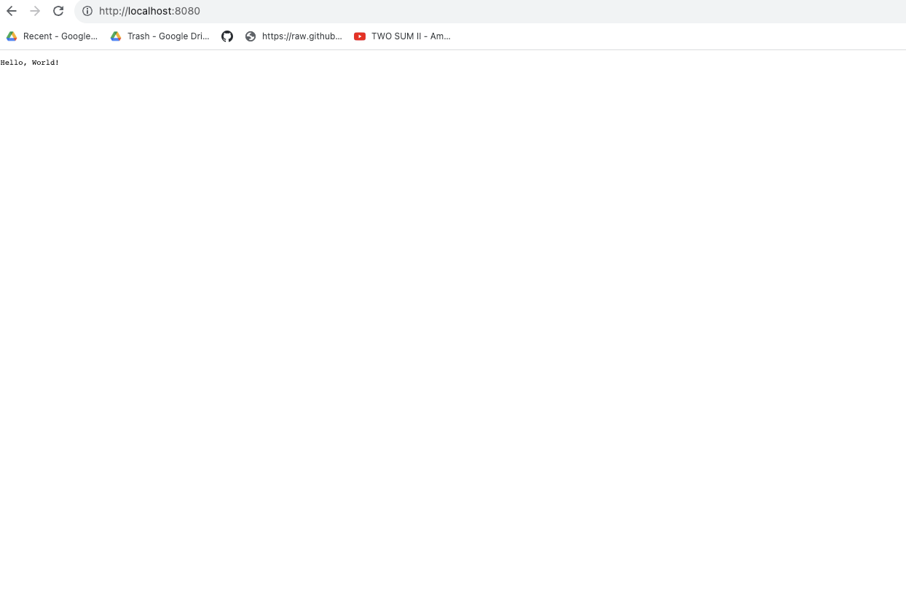

# container_build_pipeline

### Prerequisites:
- Docker installed on your system.
  
  

### Steps:

1. **Write the C code**:
   - Use a text editor to create a new file named `server.c`.
   - 

2. **Create the Dockerfile**:
   - created another file named `Dockerfile`.
   

3. **Build the Docker image**:
   - Build the Docker image with the following command:
     ```bash
     docker build -t simpleserver .
 
     ```


4. **Run the Docker container**:
   - Once the Docker image is built, you can run it using:
     ```bash
     docker run --rm -p 8080:8080 simpleserver
     ```
5. **Access the server**:
   - Open a web browser and go to `http://localhost:8080`.
     
  

6. **Cleanup (Optional)**:
   - After testing and want to remove the built Docker image, use below command:
     ```bash
     docker rmi simpleserver
     ```

